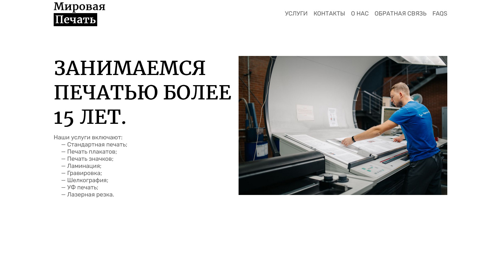
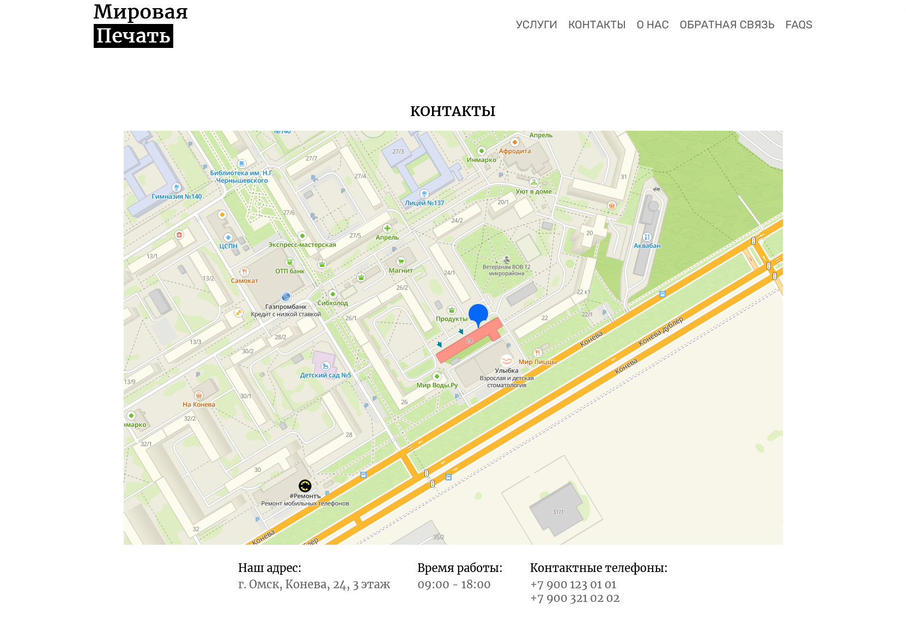
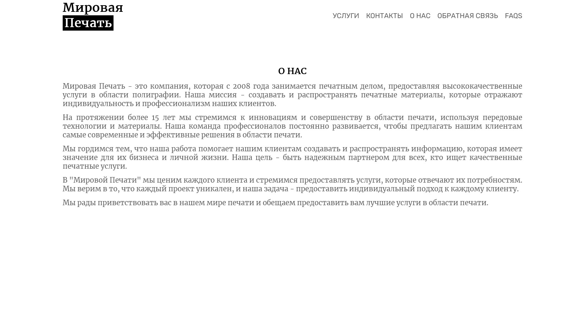

# Объектно-ориентированное программирование, ЛР 2
Сверстать сайты визитки с несколькими страницами (минимум 5 страниц). Сделать Редирект страниц через сервлеты.

## Скриншоты работы программы
 
 

