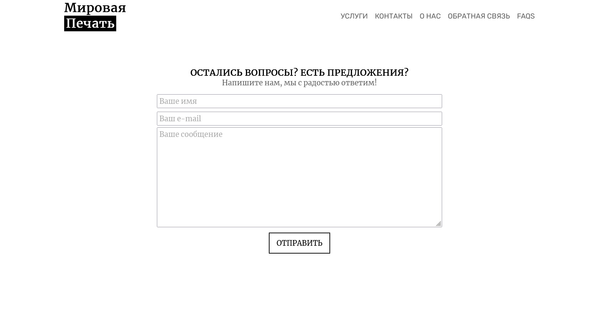
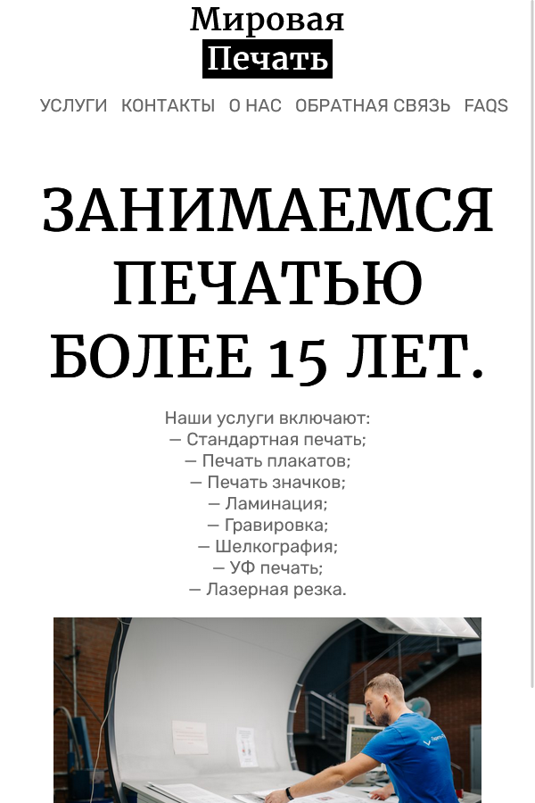
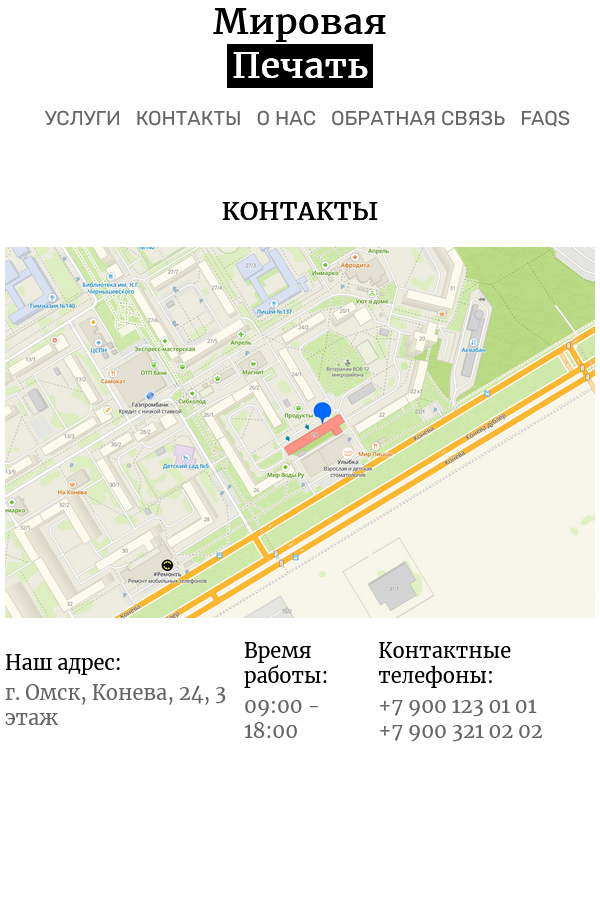
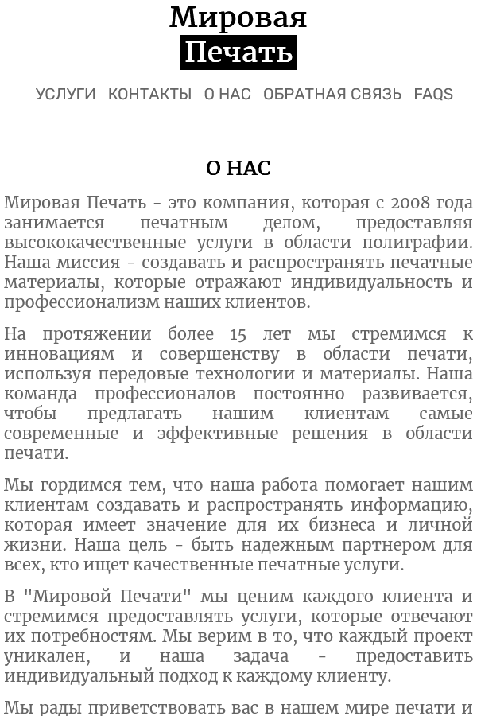
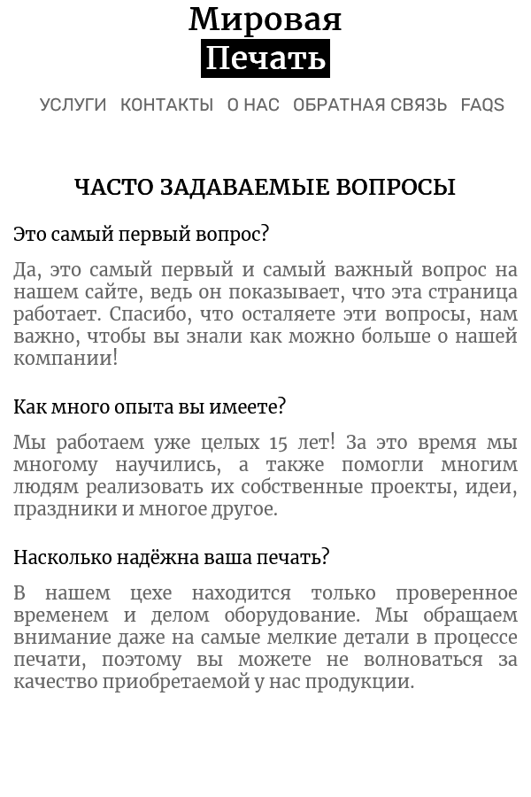

# Объектно-ориентированное программирование, ЛР 2
Сверстать сайты визитки с несколькими страницами (минимум 5 страниц). Сделать редирект страниц через сервлеты.

## Скриншоты работы программы
### Desktop версия
 
 
 
 
 
### Мобильная версия
 
 
 
 
 
